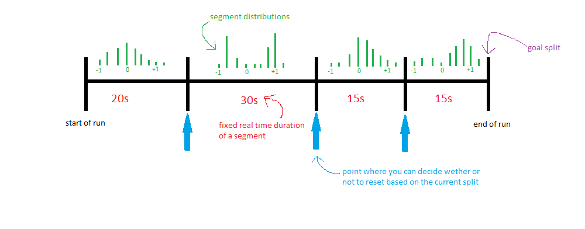

# Speedrun Reset Optimization

This project implements an algorithm for optimising reset strategies in speedrunning.
This is not only usefull for determining when to reset during a run, but also it allows you to quantitatively judge when to go for a risky strategy or for a more safe one.

## The basic idea

Before we can describe the algorithm we need to establish how exactly we model speedrunning.

### A speedrun model

In order for our measly finite computers to not explode, we start by discretizing time.

### Record density
A *Reset strategy* is a 

### The algorithm

I intend on explaining this algorithm and why it works in more mathematical rigour in a LaTeX document.

## Getting started

At the moment this project consists of just python code and cannot really be compiled in any way.
All the python code is contained in the PyCharm project ResetOptimizationCode.
The full algorithm is contained in the files `speedrun_models.py` and `reset_strategies.py`.
Example code is provded in `example_code.py`.
Only the numpy library is needed to run the code.

The hardest thing about modelling a speedrun is finding the segment distributions.
For this you can create empirical distributions based on data using the `SplitDistribution.from_data` method.
It would be ideal if this data could be automatically gathered by a timer like LiveSplit, but unfortunately I (the owner of this repository) could not understand how to write a LiveSplit component.

## Room for improvement
- Models are only models.
The definition of a speedrun model can be improved in many ways while still keeping an algorithm for finding an optimal strategy relatively easy.
For example at the end of a segment we could allow the runner to not only decide whether or not to reset, but also to decide which strategy to employ during the next segment.
This would require giving a segment distribution for each strategy.
Another example would be to allow additional variables (like the number of ammo the runner has at the end of a segment) to be taken into account when deciding wether or not to reset. 
- At the moment generating segment distributions is quite hard.
Making a livesplit extension for automatically saving splits to a file would be a huge help.
